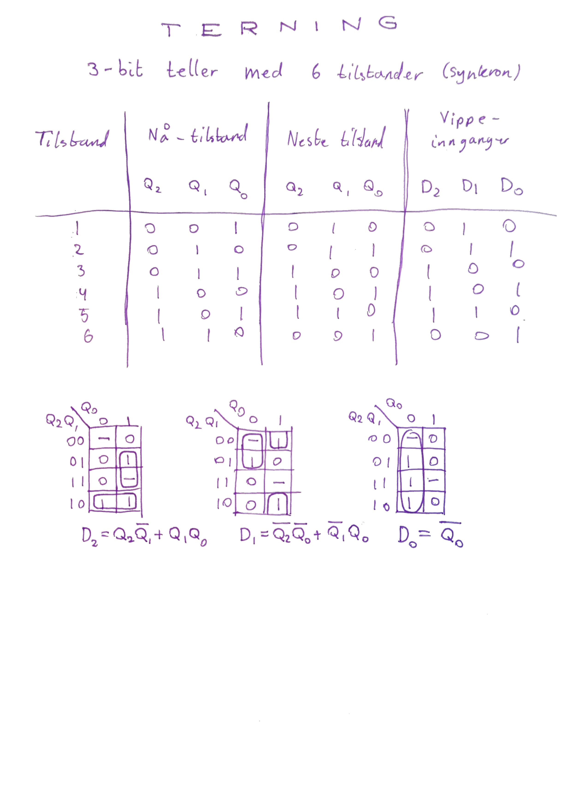
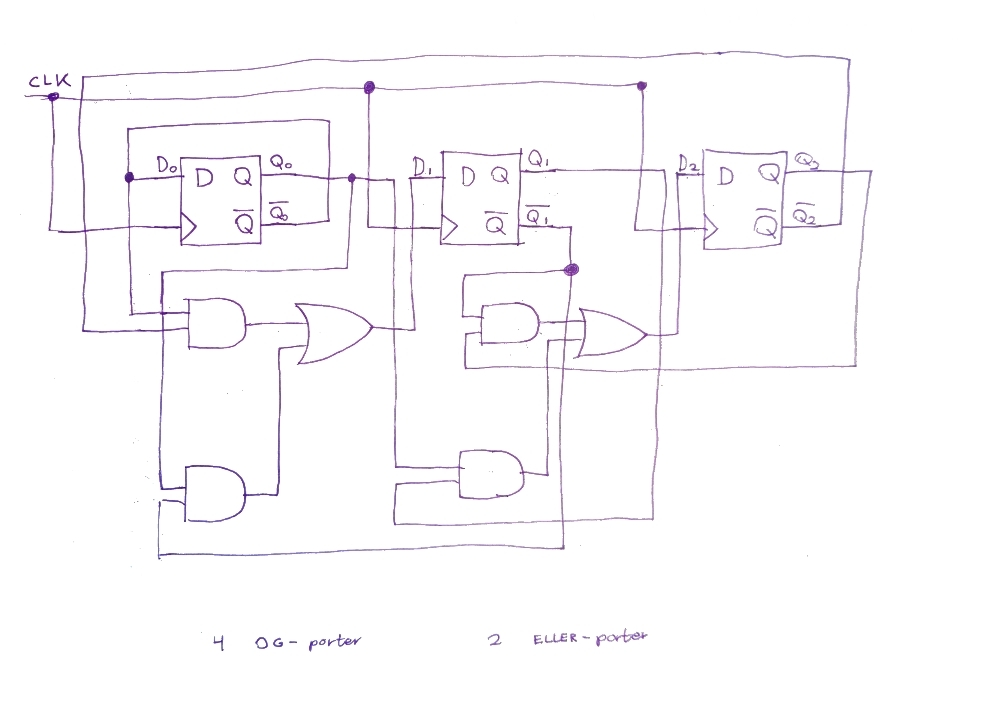

# Prosjektrapport - terning med D-vipper, logiske porter og syvsegmentdisplay
Jeg fikk i oppdrag å lage en terning ved hjelp av D-vipper og logiske porter. Terningen består av en klokke som kan justeres til ønsket hastighet, en 3-bit teller med 6 tilstander (1-6), en bryter for å koble klokka inn og ut av tellerkretsen, og et syvsegmentdisplay med tilhørende dekoder.

Jeg tok utgangspunkt i en 3-bit teller fra boka Digital Elektronikk av Knut Harald Nygaard. Telleren min hadde andre tilstander, så neste steg var å lage en nå/neste-tabell (Appendix A). Med utgangspunkt i tabellen, laget jeg Karnaugh-diagrammer for de 3 bitsene (som tilsvarer hver sin D-vippe). Diagrammene gav meg logiske uttrykk som jeg da brukte som utgangspunkt for å tegne kretsen (Appendix B). Kretsen endte opp med 2 ELLER-porter og 4 OG-porter.

I Falstad, la jeg inn kretsen jeg tegnet. Etter litt feilsøking viste det seg at én av koblingene var på feil plass. Da dette ble rettet opp i, fungerte kretsen som designet (Appendix C og D).

Til slutt koblet jeg kretsen på et prototypkort med innebygget justerbar klokke og syvsegmentdisplay med dekoder (ETS-7000). Etter litt trøbbel med at klokka hadde en veldig forvrengt firkantbølge, fikk jeg kretsen til å funke. Først med sakte telling (Appendix E) og til slutt med rask telling med bryter i klokkekretsen (Appendix F).

## Appendix A

## Appendix B

## Appendix C

## Appendix D

## Appendix E

## Appendix F

